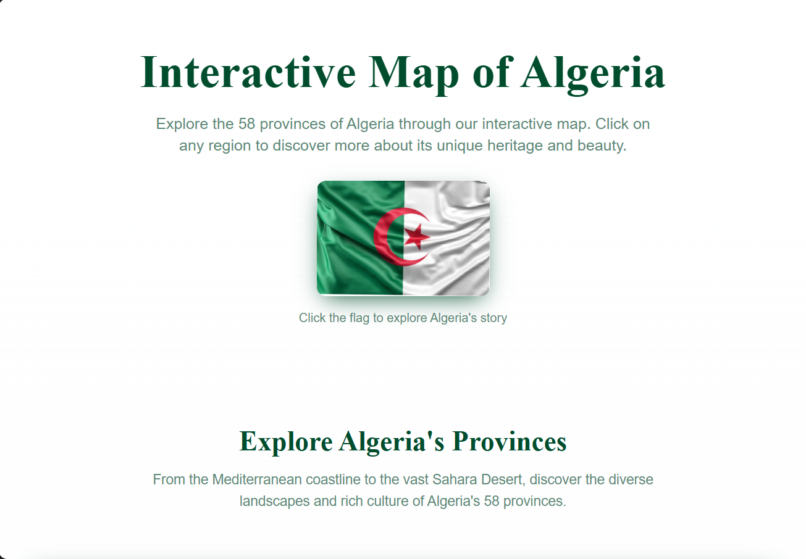
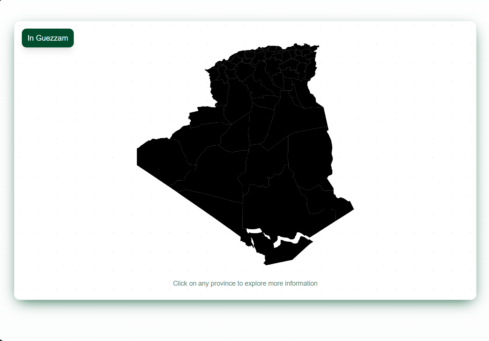
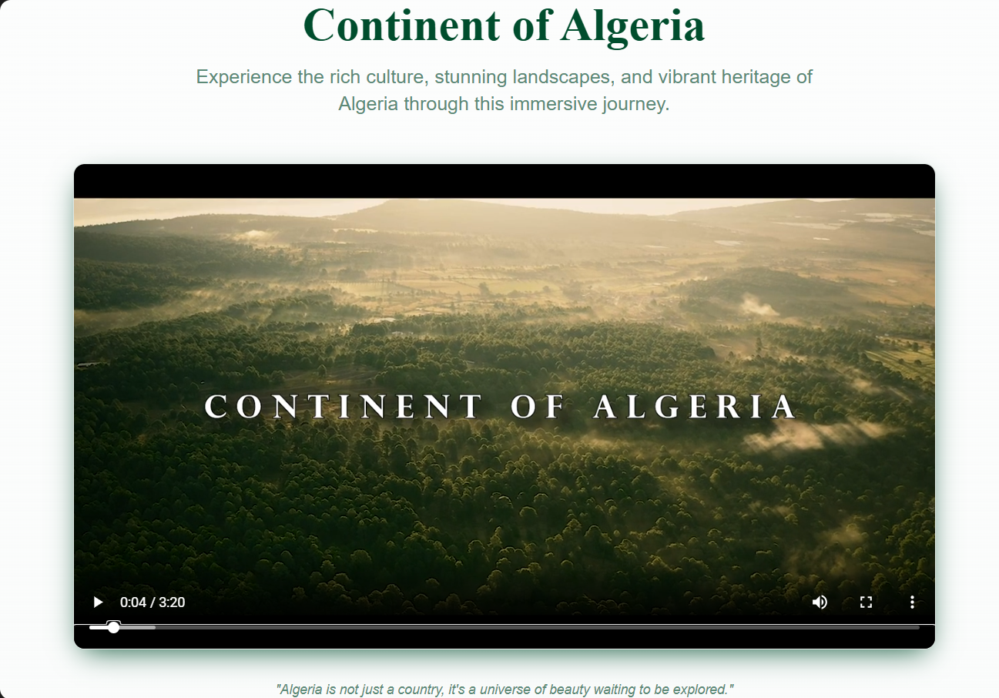

# Interactive Map of Algeria

An interactive web application showcasing the 58 provinces (wilayas) of Algeria with an immersive cinematic video experience.

## Features

- **Interactive Map**: Click on any of the 58 provinces to explore detailed information
- **Cinematic Video**: Experience Algeria's stunning landscapes and rich culture through our featured video
- **Responsive Design**: Optimized for desktop, tablet, and mobile devices
- **Accessibility**: Full keyboard navigation and screen reader support
- **Beautiful UI**: Modern design with Algerian-inspired color scheme and patterns

## Technologies Used

- **React** - Modern JavaScript library for building user interfaces
- **TypeScript** - Type-safe JavaScript for better development experience
- **Vite** - Fast build tool and development server
- **Tailwind CSS** - Utility-first CSS framework for rapid styling
- **shadcn/ui** - High-quality, accessible UI components
- **SVG Maps** - Interactive vector graphics for province mapping

## Getting Started

### Prerequisites

- Node.js (version 18 or higher)
- npm or yarn package manager

### Installation

1. Clone the repository:
```bash
git clone <your-repository-url>
cd algeria-interactive-map
```

2. Install dependencies:
```bash
npm install
```

3. Start the development server:
```bash
npm run dev
```

4. Open your browser and navigate to `http://localhost:5173`

## Project Structure

```
src/
├── components/          # Reusable UI components
│   ├── AlgerianFlag.tsx # Interactive flag component
│   ├── InteractiveMap.tsx # Main map component with 58 provinces
│   ├── VideoSection.tsx # Cinematic video player
│   └── ui/             # shadcn/ui components
├── pages/              # Application pages
│   ├── Index.tsx       # Main homepage
│   └── NotFound.tsx    # 404 error page
├── lib/                # Utility functions
└── assets/             # Static assets (images, videos)
```
## 📸 Screenshots

   
   
   

## Available Scripts

- `npm run dev` - Start development server
- `npm run build` - Build for production
- `npm run preview` - Preview production build
- `npm run lint` - Run ESLint

## Features in Detail

### Interactive Map
- All 58 Algerian provinces are clickable
- Hover effects with province names
- Direct links to search results for each province
- Accessible via keyboard navigation
- Mobile-friendly touch interactions

### Video Section
- High-quality cinematic video of Algeria
- Responsive video player with controls
- Optimized for different screen sizes

### Design System
- Custom Algerian color palette (green, white, red)
- Traditional geometric patterns
- Smooth animations and transitions
- Dark/light mode support

## Deployment

Build the project for production:

```bash
npm run build
```

The `dist` folder will contain the optimized production files ready for deployment.

## Contributing

1. Fork the repository
2. Create a feature branch (`git checkout -b feature/amazing-feature`)
3. Commit your changes (`git commit -m 'Add amazing feature'`)
4. Push to the branch (`git push origin feature/amazing-feature`)
5. Open a Pull Request

## License

This project is open source and available under the [MIT License](LICENSE).

## About Algeria

Algeria is the largest country in Africa and the Arab world, known for its diverse landscapes from Mediterranean coastlines to vast Sahara Desert regions. The country is divided into 58 provinces (wilayas), each with its unique cultural heritage and geographical features.

---

**Made with ❤️ for Algeria**
